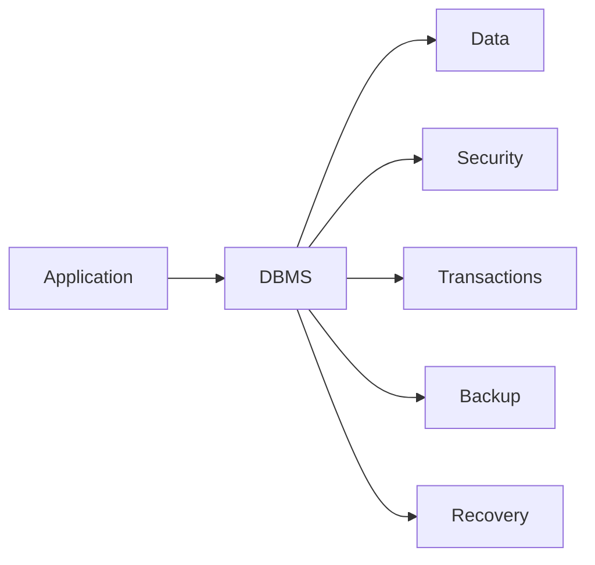
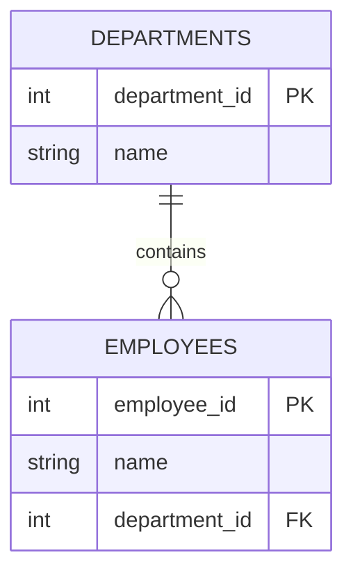
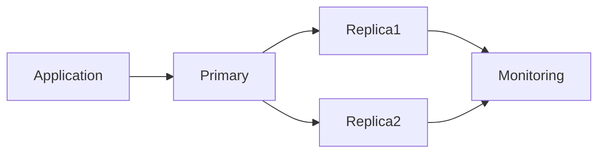
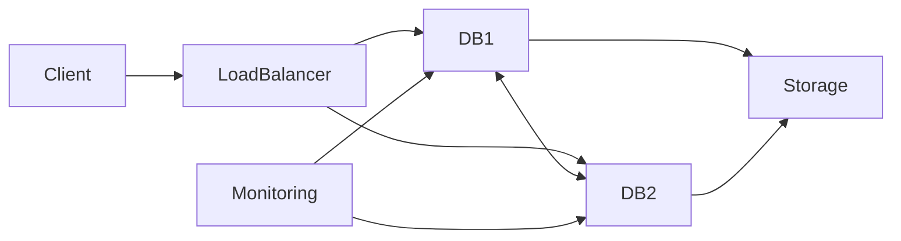
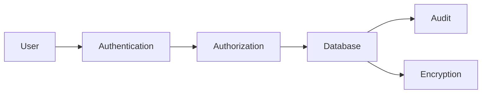
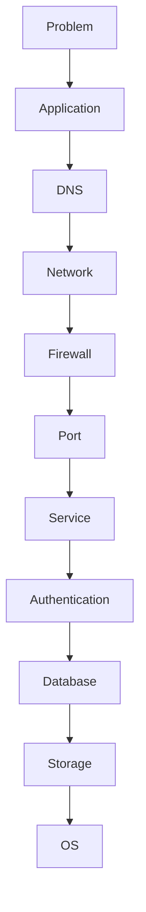

# Database Fundamentals

> Goal: build a strong foundation before learning individual databases.

---

## 1. What Is a Database?

A **database** is an organized collection of data that can be stored, retrieved, changed, and managed efficiently.

### Simple example

A company may need to store:

```text
Employee
---------
ID
Name
Department
Salary
Joining Date
```

Instead of keeping thousands of records in unrelated files, a database provides a structured system for storing and retrieving them.

### Real-world example

An application may have:

```text
User
  ↓
Application
  ↓
Database
  ↓
User / Order / Payment data
```

For example, an e-commerce application may store:

- Customers
- Products
- Orders
- Payments
- Inventory

### DBA / Linux relevance

A DBA or Linux administrator may need to investigate:

```text
Application cannot connect
        ↓
Is database running?
        ↓
Is port listening?
        ↓
Is DNS working?
        ↓
Is firewall allowing traffic?
        ↓
Is authentication working?
        ↓
Is database healthy?
```

---

## 2. What Is a DBMS?

**DBMS = Database Management System**

A DBMS is software that provides mechanisms to:

- Store data
- Retrieve data
- Modify data
- Delete data
- Manage users
- Control access
- Handle transactions
- Provide recovery
- Maintain consistency

Examples include:

- PostgreSQL
- MySQL
- MariaDB
- MongoDB
- Microsoft SQL Server
- Oracle Database

Conceptually:



---

## 3. What Is an RDBMS?

**RDBMS = Relational Database Management System**

An RDBMS stores data primarily in **tables** and represents relationships between tables.

Example:

### Employee table

| employee_id | name | department_id |
|---|---|---:|
| 101 | Ravi | 10 |
| 102 | Amit | 20 |

### Department table

| department_id | department_name |
|---:|---|
| 10 | Linux |
| 20 | Database |

The relationship is:

```text
Employee.department_id
        ↓
Department.department_id
```

Common relational databases:

- PostgreSQL
- MySQL
- MariaDB
- Oracle Database
- Microsoft SQL Server
- SQLite

---

## 4. SQL

**SQL = Structured Query Language**

SQL is commonly used to interact with relational databases.

Example:

```sql
SELECT * FROM employees;
```

Insert:

```sql
INSERT INTO employees (employee_id, name)
VALUES (101, 'Ravi');
```

Update:

```sql
UPDATE employees
SET name = 'Ravi Kumar'
WHERE employee_id = 101;
```

Delete:

```sql
DELETE FROM employees
WHERE employee_id = 101;
```

SQL is used for both application operations and DBA administration.

---

## 5. NoSQL

**NoSQL** generally refers to non-relational database systems with data models that differ from traditional relational tables.

Common categories include:

| Type | Example |
|---|---|
| Document | MongoDB, CouchDB |
| Key-value | Redis |
| Wide-column | Cassandra |
| Graph | Neo4j |
| Distributed SQL | CockroachDB, YugabyteDB, TiDB |

Example document:

```json
{
  "id": 101,
  "name": "Ravi",
  "department": "Linux"
}
```

### Important

NoSQL does **not** simply mean "no SQL."

Different NoSQL systems provide different query languages, consistency models, indexing mechanisms, replication models, and operational behavior.

---

## 6. SQL vs NoSQL

| Area | SQL / Relational | NoSQL |
|---|---|---|
| Primary model | Tables | Document/key-value/graph/wide-column etc. |
| Schema | Usually structured | Often more flexible |
| Relationships | Strong relational model | Depends on database |
| Query language | SQL | Database-specific |
| Transactions | Commonly strong transactional support | Depends on system |
| Scaling | Often scale-up and selected scale-out designs | Many systems designed for distributed scale |
| Examples | PostgreSQL, MySQL | MongoDB, Redis, Cassandra |

Do not choose a database solely because it is SQL or NoSQL. Choose based on application requirements.

---

# 7. OLTP

**OLTP = Online Transaction Processing**

OLTP systems handle many operational transactions.

Examples:

- Banking transactions
- Order creation
- Ticket booking
- Payment processing
- Inventory updates

Typical characteristics:

```text
Many users
    ↓
Many small transactions
    ↓
Fast reads/writes
    ↓
Strong correctness requirements
```

Example:

```sql
BEGIN;

UPDATE accounts
SET balance = balance - 100
WHERE account_id = 1;

UPDATE accounts
SET balance = balance + 100
WHERE account_id = 2;

COMMIT;
```

---

# 8. OLAP

**OLAP = Online Analytical Processing**

OLAP focuses on analyzing large amounts of data.

Examples:

- Monthly sales analysis
- Business dashboards
- Historical reporting
- Data warehouse queries
- Trend analysis

Conceptually:

```text
Operational Database
        ↓
ETL / ELT
        ↓
Analytical Storage
        ↓
Reports / BI / Analytics
```

OLTP and OLAP have different workload characteristics.

---

# 9. ACID

ACID describes important transaction properties in transactional database systems.

```text
A = Atomicity
C = Consistency
I = Isolation
D = Durability
```

## Atomicity

A transaction is treated as an all-or-nothing operation.

```text
Transaction
   ↓
All operations succeed
   OR
All are rolled back
```

Example:

```text
Debit account A
Credit account B
```

If the transaction fails before completion, the database should not leave the transaction in an unintended partial state.

## Consistency

A successful transaction preserves the database rules and constraints.

## Isolation

Concurrent transactions should behave according to the database's isolation rules.

## Durability

Once a transaction is committed, the database provides mechanisms intended to preserve that committed state across failures.

---

# 10. BASE

BASE is a model commonly associated with highly distributed systems.

It is often expanded as:

```text
Basically Available
Soft state
Eventual consistency
```

The exact behavior depends on the database.

The important learning point is that distributed systems may make different trade-offs between availability, consistency, latency, and partition tolerance.

---

# 11. CAP Theorem

CAP discusses behavior in a distributed system when a network partition occurs.

The three terms are:

```text
C = Consistency
A = Availability
P = Partition tolerance
```

A simplified mental model:

```text
             CAP
            / | \
           C  A  P
```

The important operational point is:

> When a network partition occurs, a distributed system must make trade-offs between consistency and availability.

Do not interpret CAP as simply "choose any two of the three" for every system. Real database behavior depends on the specific architecture, failure model, quorum rules, and consistency guarantees.

---

# 12. Transactions

A transaction is a logical unit of database work.

Typical lifecycle:

```text
BEGIN
  ↓
SQL Operations
  ↓
Validation
  ↓
COMMIT
```

If something fails:

```text
BEGIN
  ↓
SQL Operations
  ↓
ERROR
  ↓
ROLLBACK
```

Example:

```sql
BEGIN;

UPDATE inventory
SET quantity = quantity - 1
WHERE product_id = 100;

INSERT INTO orders(order_id, product_id)
VALUES (5001, 100);

COMMIT;
```

---

# 13. Primary Key

A **primary key** uniquely identifies a row.

Example:

```sql
CREATE TABLE employees (
    employee_id INTEGER PRIMARY KEY,
    name VARCHAR(100)
);
```

Here:

```text
employee_id
     ↓
Unique row identity
```

A primary key normally prevents duplicate identities and does not allow NULL values.

---

# 14. Foreign Key

A **foreign key** creates a relationship to a key in another table.

Example:

```sql
CREATE TABLE departments (
    department_id INTEGER PRIMARY KEY,
    name VARCHAR(100)
);

CREATE TABLE employees (
    employee_id INTEGER PRIMARY KEY,
    name VARCHAR(100),
    department_id INTEGER,
    FOREIGN KEY (department_id)
        REFERENCES departments(department_id)
);
```

Relationship:



---

# 15. Constraints

Constraints enforce rules on data.

Common constraints:

- PRIMARY KEY
- FOREIGN KEY
- UNIQUE
- NOT NULL
- CHECK
- DEFAULT

Example:

```sql
CREATE TABLE users (
    id INTEGER PRIMARY KEY,
    username VARCHAR(100) NOT NULL UNIQUE,
    age INTEGER CHECK (age >= 18),
    status VARCHAR(20) DEFAULT 'active'
);
```

---

# 16. Indexes

An index is a data structure used to help the database find rows efficiently.

Without an appropriate index:

```text
Query
  ↓
Potentially inspect many rows
  ↓
Return matching rows
```

With an appropriate index:

```text
Query
  ↓
Index lookup
  ↓
Locate matching rows
  ↓
Return data
```

Example:

```sql
CREATE INDEX idx_users_username
ON users(username);
```

### Important production warning

Indexes are not free.

They can:

- Consume storage
- Increase write overhead
- Increase maintenance work
- Be ineffective for unsuitable query patterns

Therefore, index design should be based on actual workload and query plans.

---

# 17. Views

A **view** is a database-defined query that can be queried like a logical table.

Example:

```sql
CREATE VIEW active_users AS
SELECT id, username
FROM users
WHERE status = 'active';
```

Then:

```sql
SELECT * FROM active_users;
```

Views can simplify access to complex queries and can also be useful for controlled data exposure.

---

# 18. Stored Procedures

A stored procedure is executable database-side logic supported by many database systems.

Use cases can include:

- Reusable database operations
- Complex administrative/business operations
- Reducing repeated client-side logic

Syntax differs significantly between databases, so always use the database's supported syntax.

---

# 19. Functions

A database function performs an operation and may return a value or result set depending on the database.

Example concept:

```text
Application
    ↓
Database Function
    ↓
Calculation
    ↓
Result
```

Function syntax and capabilities are database-specific.

---

# 20. Triggers

A trigger automatically executes database-defined logic when specified events occur.

Typical events:

- INSERT
- UPDATE
- DELETE

Concept:

```text
INSERT
  ↓
Trigger
  ↓
Additional database action
```

Triggers should be designed carefully because hidden side effects can make troubleshooting more difficult.

---

# 21. Replication

Replication means maintaining copies of database data across multiple database instances or nodes.

Basic concept:



Common concepts:

- Primary
- Replica
- Leader
- Follower
- Synchronous replication
- Asynchronous replication
- Replication lag
- Failover
- Switchover

Replication is not automatically the same as backup.

---

# 22. Sharding

Sharding distributes data across multiple database nodes.

Example:

```text
Customer ID
    ↓
Shard calculation
    ↓
+---------+---------+---------+
| Shard 1 | Shard 2 | Shard 3 |
+---------+---------+---------+
```

Example:

```text
Customer 1-1,000,000
        ↓
Shard 1

Customer 1,000,001-2,000,000
        ↓
Shard 2
```

Actual sharding strategies vary by database.

---

# 23. Partitioning

Partitioning divides a logical dataset into smaller physical/logical partitions.

Common approaches include:

- Range partitioning
- List partitioning
- Hash partitioning

Example:

```text
orders
  |
  +-- orders_2025
  |
  +-- orders_2026
  |
  +-- orders_2027
```

Partitioning can help administration and query performance for suitable workloads.

Partitioning is different from sharding:

```text
Partitioning
    ↓
Usually within one database system/logical database

Sharding
    ↓
Distributes data across multiple database nodes
```

The exact implementation depends on the database.

---

# 24. Clustering

"Cluster" can mean different things depending on the database.

It may refer to:

- Multiple database instances
- HA nodes
- Replication groups
- Distributed database nodes
- Database-specific cluster constructs

Never assume that "cluster" has the same meaning across PostgreSQL, MySQL, MongoDB, Cassandra, Elasticsearch, or other systems.

Always use the database-specific definition.

---

# 25. High Availability

**HA = High Availability**

The objective is to reduce service interruption when components fail.

Typical architecture:



HA may involve:

- Health checks
- Replication
- Quorum
- Leader election
- Failover
- Load balancing
- VIP
- DNS
- Operators
- Database-specific HA software

HA does not automatically mean zero downtime.

---

# 26. Disaster Recovery

**DR = Disaster Recovery**

DR focuses on recovering service and data after a major failure.

Examples:

- Complete server failure
- Storage failure
- Site failure
- Cluster failure
- Accidental deletion
- Major corruption

Basic model:

```text
Production
    ↓
Backup / Replication
    ↓
DR Environment
    ↓
Recovery
    ↓
Application Validation
```

Important DR concepts:

- RPO
- RTO
- Backup
- Replication
- Recovery procedures
- Restore testing
- Runbooks
- Failover
- Failback

---

# 27. Backup

A backup is a recoverable copy of data created according to a defined backup strategy.

Common types:

- Logical backup
- Physical backup
- Full backup
- Incremental backup
- Differential backup
- Snapshot

Concept:

```text
Production Database
       ↓
     Backup
       ↓
   Backup Storage
       ↓
    Verification
       ↓
   Restore Test
```

A successful backup command does not automatically prove that the backup is recoverable.

---

# 28. Point-in-Time Recovery

**PITR = Point-in-Time Recovery**

PITR allows recovery to a specific point in time when the database's backup/recovery architecture supports it.

Conceptually:

```text
Full Backup
    +
Transaction Logs / WAL / Journal
    ↓
Recovery
    ↓
Target Time
```

Example requirement:

> Restore the database to the state just before an accidental DELETE at 14:35.

Whether and how PITR works depends on the database.

---

# 29. Connection Pooling

Connection pooling maintains reusable database connections.

Without pooling:

```text
Application Request
      ↓
Create connection
      ↓
Execute query
      ↓
Close connection
```

With pooling:

```text
Application
     ↓
Connection Pool
     ↓
+----+----+----+----+
| C1 | C2 | C3 | C4 |
+----+----+----+----+
     ↓
Database
```

Benefits may include:

- Reduced connection establishment overhead
- Controlled concurrent connections
- Better application/database resource management

However, pool size must be designed carefully.

Too many connections can overload a database.

---

# 30. Database Security

Database security protects:

```text
Data
Users
Credentials
Connections
Backups
Database Services
```

Important controls:

- Authentication
- Authorization
- RBAC
- TLS
- Encryption in transit
- Encryption at rest
- Least privilege
- Firewall
- Network segmentation
- Secrets management
- Audit logging
- Secure backups
- Password policy

Basic model:



---

# 31. Authentication vs Authorization

These two concepts are frequently asked in interviews.

## Authentication

**Who are you?**

Example:

```text
Username + Password
Certificate
Kerberos
LDAP
```

## Authorization

**What are you allowed to do?**

Example:

```text
User A → SELECT
User B → SELECT + INSERT
DBA → Administrative operations
```

Mental model:

```text
Authentication
      ↓
Who are you?
      ↓
Authorization
      ↓
What can you do?
```

---

# 32. Database Monitoring

Monitoring tells us whether the database is healthy and how it is behaving.

Monitor at multiple levels.

## Linux level

```bash
uptime
free -h
df -h
top
vmstat
iostat
ss -lntp
```

## Database level

Depending on the database:

```text
Connections
Queries
Transactions
Locks
Deadlocks
Cache
CPU
Memory
Disk I/O
Replication lag
Errors
Backup status
```

## Platform level

For Kubernetes/OpenShift:

```text
Pod
PVC
PV
StorageClass
Service
Network
Resource limits
Events
Operator
```

---

# 33. Performance Tuning

Database performance is a system-level problem.

Use this mental model:

```text
Application
    ↓
Connection Pool
    ↓
Network
    ↓
Database
    ↓
Query
    ↓
Indexes
    ↓
Memory
    ↓
CPU
    ↓
Storage / IOPS
```

Common symptoms:

- Slow queries
- High CPU
- High memory
- High disk I/O
- High connection count
- Lock contention
- Deadlocks
- Replication lag
- Network latency

Do not immediately increase memory or CPU.

First investigate the actual bottleneck.

---

# 34. Linux + Database Troubleshooting Model

A strong DBA/Linux engineer should investigate from multiple layers.



Example:

> Application reports "connection refused".

Do not immediately restart the database.

Investigate:

```bash
# Is DNS resolving?
getent hosts db01

# Is the host reachable?
ping -c 3 db01

# Is the port reachable?
nc -vz db01 <port>

# Is the service running?
systemctl status <service>

# Is the port listening?
ss -lntp

# Check recent service logs
journalctl -u <service> --since "15 minutes ago"
```

The exact commands and database-specific checks will be documented in later database chapters.

---

# 35. Storage and Database Relationship

Databases depend heavily on storage behavior.

Important storage characteristics:

- Capacity
- IOPS
- Throughput
- Latency
- Filesystem
- RAID/storage architecture
- Persistent volumes
- Snapshots

Typical problem:

```text
Disk Usage = 95%
       ↓
Database writes fail
       ↓
Transactions fail
       ↓
Application errors
```

Therefore disk monitoring is a database availability concern.

---

# 36. Database on Kubernetes

A database running on Kubernetes introduces additional layers:

```text
Application
    ↓
Service
    ↓
Pod
    ↓
StatefulSet / Operator
    ↓
PVC
    ↓
PV
    ↓
StorageClass
    ↓
Storage System
```

Important concepts:

- StatefulSet
- PersistentVolumeClaim
- PersistentVolume
- StorageClass
- Service
- Headless Service
- Secret
- ConfigMap
- Probes
- Resource requests/limits
- PodDisruptionBudget
- Anti-affinity
- Operator

Databases are stateful workloads, so storage, identity, recovery, and lifecycle management require special attention.

---

# 37. Database on OpenShift

OpenShift adds platform-level concepts:

```text
OpenShift Project
      ↓
Database Workload
      ↓
Service
      ↓
PVC
      ↓
Storage
```

Depending on the deployment method, additional components may include:

- Operator
- Secret
- ConfigMap
- Security Context
- SCC
- Route where appropriate
- Monitoring
- Backup tooling

For database deployments, prefer a suitable supported Operator when one exists, but always distinguish vendor-supported, community, and manual deployment approaches.

---

# 38. Backup vs Replication

This is a very important interview concept.

## Replication

```text
Primary
   ↓
Replica
```

Purpose:

- Availability
- Read scaling in some architectures
- Failover
- Disaster recovery in some designs

## Backup

```text
Database
   ↓
Backup Storage
```

Purpose:

- Recovery from deletion
- Recovery from corruption
- Historical recovery
- Disaster recovery

Replication does **not** replace backup.

If bad data is replicated:

```text
Bad change
   ↓
Primary
   ↓
Replica
```

The replica may receive the same bad change.

---

# 39. HA vs Backup vs DR

| Concept | Main Purpose |
|---|---|
| HA | Reduce service interruption |
| Replication | Maintain copies / support availability or scaling depending on architecture |
| Backup | Recover data |
| DR | Recover service/data from major failure |
| PITR | Recover to a specific supported point in time |

These concepts complement each other.

---

# 40. Production Mental Model

When troubleshooting a database, think:

```text
1. What is the symptom?
        ↓
2. What changed?
        ↓
3. Is the database reachable?
        ↓
4. Is the service healthy?
        ↓
5. Is the OS healthy?
        ↓
6. Is storage healthy?
        ↓
7. Is the database healthy?
        ↓
8. Are queries healthy?
        ↓
9. Is replication healthy?
        ↓
10. Is the application healthy?
        ↓
11. What is the root cause?
        ↓
12. What is the safe fix?
        ↓
13. How do we verify?
        ↓
14. How do we prevent recurrence?
```

This is the foundation for L2/L3 troubleshooting.

---

# 41. Important Interview Differences

## Database vs DBMS

```text
Database = Data
DBMS = Software that manages the data
```

## SQL vs NoSQL

```text
SQL = relational model commonly using SQL
NoSQL = multiple non-relational data models
```

## Primary Key vs Foreign Key

```text
Primary Key = identifies a row
Foreign Key = represents a relationship to another table's key
```

## Authentication vs Authorization

```text
Authentication = Who are you?
Authorization = What can you do?
```

## Backup vs Replication

```text
Backup = recovery copy
Replication = maintained copy/replica
```

## HA vs DR

```text
HA = minimize interruption
DR = recover after major failure
```

## Partitioning vs Sharding

```text
Partitioning = divide a dataset into partitions
Sharding = distribute data across nodes
```

---

# 42. Quick Revision — 5 Minutes

Remember this:

```text
Database
  ↓
DBMS
  ↓
Data
  ↓
Transactions
  ↓
ACID
  ↓
Security
  ↓
Backup
  ↓
Replication
  ↓
HA
  ↓
Monitoring
  ↓
Performance
  ↓
Troubleshooting
  ↓
Recovery
```

Core terms:

```text
RDBMS       → Tables + relationships
NoSQL       → Non-relational data models
OLTP        → Transaction workloads
OLAP        → Analytical workloads
ACID        → Transaction properties
CAP         → Distributed-system trade-offs
Index       → Faster data access for suitable queries
Replication → Maintained copies
Sharding    → Data distributed across nodes
Partition   → Dataset divided into partitions
HA          → Availability during failures
DR          → Recovery from major failures
PITR        → Recover to a supported point in time
RBAC        → Role-based access control
```

---

# 43. 15-Minute Revision

Be able to explain:

```text
1. Database vs DBMS
2. RDBMS
3. SQL
4. NoSQL
5. OLTP vs OLAP
6. ACID
7. BASE
8. CAP
9. Transactions
10. Primary/Foreign keys
11. Constraints
12. Indexes
13. Views
14. Replication
15. Sharding
16. Partitioning
17. HA
18. DR
19. Backup
20. PITR
21. Connection pooling
22. Security
23. Monitoring
24. Performance
25. Kubernetes database architecture
```

---

# 44. 30-Minute Lab — Linux Database Investigation Foundation

These commands do not require a specific database installation.

## Check OS

```bash
cat /etc/os-release
```

### What does it do?

Displays Linux distribution and version information.

### Verification

```bash
cat /etc/os-release
```

Look for fields such as:

```text
NAME=
VERSION=
```

---

## Check Hostname

```bash
hostnamectl
```

### Why?

Database systems often rely on predictable hostname and network configuration.

---

## Check IP

```bash
ip addr
```

### Why?

Confirms the server's network addresses.

---

## Check DNS

```bash
getent hosts localhost
```

For a real database hostname:

```bash
getent hosts <database-hostname>
```

---

## Check Listening Ports

```bash
ss -lntp
```

### Why?

Determines which TCP ports are listening and which processes own them.

---

## Check Filesystem

```bash
df -h
```

### Why?

Database outages can occur when the filesystem becomes full.

---

## Check Memory

```bash
free -h
```

---

## Check CPU / Processes

```bash
top
```

---

## Check System Logs

```bash
journalctl -p warning..alert --since "30 minutes ago"
```

---

# 45. L2/L3 Troubleshooting Exercise

Assume an application reports:

```text
Database connection failed
```

Use this sequence:

```bash
# 1. Resolve hostname
getent hosts <database-hostname>

# 2. Test network reachability
ping -c 3 <database-hostname>

# 3. Test database port
nc -vz <database-hostname> <database-port>

# 4. Check listening sockets
ss -lntp

# 5. Check service
systemctl status <database-service>

# 6. Review service logs
journalctl -u <database-service> --since "30 minutes ago"

# 7. Check filesystem
df -h

# 8. Check memory
free -h
```

### Investigation principle

Do not randomly restart services.

Use:

```text
Symptom
  ↓
Evidence
  ↓
Investigation
  ↓
Root Cause
  ↓
Fix
  ↓
Verification
```

---

# 46. Final Mental Model

The most important mental model for this entire handbook is:

```text
              DATABASE
                  |
       +----------+----------+
       |          |          |
    Security   Storage   Performance
       |          |          |
       +----------+----------+
                  |
             Operations
                  |
       +----------+----------+
       |          |          |
    Backup    Replication    HA
       |          |          |
       +----------+----------+
                  |
             Monitoring
                  |
          Troubleshooting
                  |
              Recovery
                  |
       Kubernetes/OpenShift
```

Once this foundation is clear, each database can be learned using the same operational pattern:

```text
UNDERSTAND
    ↓
INSTALL
    ↓
CONFIGURE
    ↓
SECURE
    ↓
OPERATE
    ↓
BACKUP
    ↓
REPLICATE
    ↓
MAKE HIGHLY AVAILABLE
    ↓
MONITOR
    ↓
TUNE
    ↓
TROUBLESHOOT
    ↓
RECOVER
    ↓
AUTOMATE
```

---

# End of Phase 1 Fundamentals
