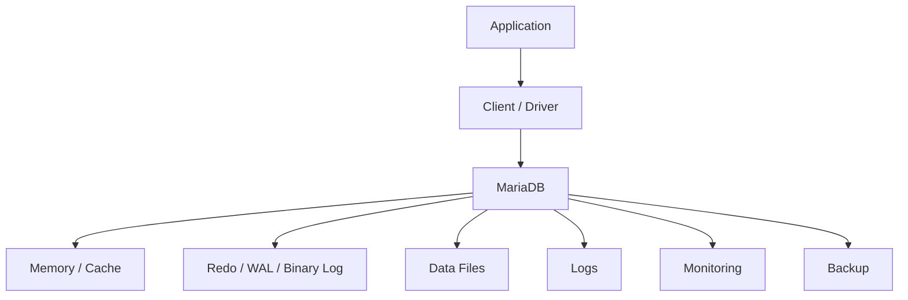

# MariaDB Administration Handbook

## 1. What is MariaDB?

MariaDB is a Open-source relational SQL database descended from the MySQL codebase. This chapter set treats it as an operating system + database service rather than only as a SQL product.

## 2. Learning path

```text
Understand
   ↓
Install
   ↓
Verify
   ↓
Configure
   ↓
Create databases/users
   ↓
Secure
   ↓
Operate
   ↓
Backup
   ↓
Restore
   ↓
Replicate
   ↓
Monitor
   ↓
Tune
   ↓
Troubleshoot
   ↓
Recover
   ↓
Run on Docker/Kubernetes/OpenShift
```

## 3. Core facts

| Item | Value |
|---|---|
| Database | MariaDB |
| Current baseline | 12.3.3 |
| Default port | 3306 |
| Service | `mariadb.service` |
| CLI | `mariadb` |
| Data directory | `/var/lib/mysql` |
| Configuration | `/etc/my.cnf.d/` |
| Replication | Primary/replica binary-log replication; Galera-based synchronous multi-primary clustering |
| HA | Galera Cluster and MaxScale-based architectures; Kubernetes Operator patterns |
| Backup | mariadb-dump and MariaDB Backup depending on logical/physical recovery requirements |

## 4. Main components



## 5. File map

| File | Purpose |
|---|---|
| 01-installation.md | Fresh-server installation and validation |
| 02-architecture.md | Internal architecture and request flow |
| 03-configuration.md | Configuration model and safe change process |
| 04-users-roles-permissions.md | Identity and authorization |
| 05-database-operations.md | Daily DBA commands |
| 06-storage.md | Filesystems, capacity and I/O |
| 07-backup-restore.md | Backup, restore and recovery |
| 08-replication.md | Replication models and health |
| 09-high-availability.md | HA design and failure handling |
| 10-security.md | Hardening and secure access |
| 11-performance-tuning.md | Workload diagnosis and tuning |
| 12-monitoring.md | Metrics and health checks |
| 13-logging.md | Logs and evidence collection |
| 14-troubleshooting.md | L2/L3 RCA workflows |
| 15-docker.md | Container deployment |
| 16-kubernetes.md | Kubernetes deployment concepts |
| 17-openshift.md | OpenShift deployment concepts |
| 18-migration.md | Migration planning and execution |
| 19-upgrade.md | Upgrade planning and rollback |
| 20-production-scenarios.md | Corporate incidents and RCA |
| 21-interview-questions.md | L1/L2/L3 interview preparation |
| 22-quick-revision.md | Fast revision and commands |

## 6. When to use

Use MariaDB when its consistency model, ecosystem, operational model and application compatibility fit the workload. Evaluate workload requirements rather than choosing a database from popularity alone.

## 7. Operational golden rules

1. Never modify production configuration without recording the old value.
2. Take a recoverable backup before risky changes.
3. Monitor capacity before it becomes an outage.
4. Separate database symptoms from Linux symptoms.
5. Check replication health before planned failover.
6. Test restores; a backup file alone is not proof of recoverability.
7. Document version-specific commands.
8. Prefer least privilege.
9. Measure before tuning.
10. Record an RCA after significant incidents.

## 8. Interview mental model

```text
PORT → PROCESS → CONNECTION → QUERY
                    ↓
             MEMORY / CACHE
                    ↓
             STORAGE / LOG
                    ↓
       BACKUP → REPLICATION → HA
                    ↓
          MONITOR → TROUBLESHOOT
```
