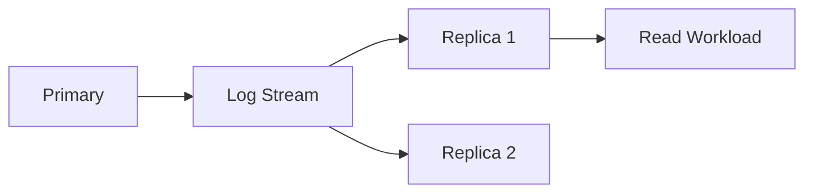

# MySQL — Replication

> Database baseline: 9.7 LTS  
> Default port: 3306  
> Linux service: `mysqld.service`

## Scope

This chapter is written for Linux Administrator / DBA / DevOps / SRE / Kubernetes / OpenShift work. Commands are examples for a controlled lab and must be adapted to the installed version and environment.

## Assumptions

```text
OS: RHEL 9 or compatible Enterprise Linux
Hostname: db01
Database: MySQL
Port: 3306
Administrative access: root or sudo
```

## 1. Replication purpose

Replication can provide:
- read scaling
- standby capacity
- disaster recovery
- maintenance flexibility
- reduced recovery time

Replication is not automatically a backup.

## 2. Generic model



## 3. Health dimensions

Measure:
- connectivity
- log shipping
- receiver status
- replay/apply status
- lag
- errors
- disk capacity
- timeline/GTID state where applicable

## 4. Linux evidence

```bash
ss -antp
journalctl -u {service} --since "30 min ago"
df -hT
```

## 5. L3 investigation

If replication lag increases:
1. Confirm network latency.
2. Check primary log generation rate.
3. Check replica CPU.
4. Check replica I/O latency.
5. Check long-running transactions.
6. Check locks.
7. Check replication errors.
8. Compare replay/apply rate with generation rate.

## MySQL-specific operational notes

- Default port: `3306`.
- Service name in this handbook: `mysqld.service`.
- CLI: `mysql`.
- Data location used as a lab baseline: `/var/lib/mysql`.
- Replication model: Binary-log based asynchronous/semi-synchronous replication; Group Replication for HA topologies.
- HA model: MySQL InnoDB Cluster/Group Replication and Router patterns.

## Validation principle

A command is not considered successful until its effect is verified. Prefer:
```bash
systemctl is-active mysqld.service
ss -lntp | grep 3306
```
plus a database-native health query.

## Version discipline

Do not assume that an older blog post, copied command, or container tag applies to the current release. Record the exact installed version and consult the vendor's current documentation when syntax or behavior is version-sensitive.
