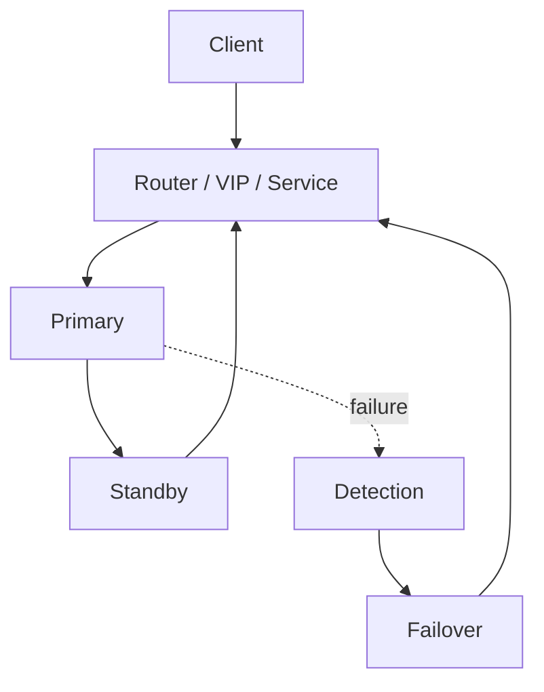

# MySQL — High Availability

> Database baseline: 9.7 LTS  
> Default port: 3306  
> Linux service: `mysqld.service`

## Scope

This chapter is written for Linux Administrator / DBA / DevOps / SRE / Kubernetes / OpenShift work. Commands are examples for a controlled lab and must be adapted to the installed version and environment.

## Assumptions

```text
OS: RHEL 9 or compatible Enterprise Linux
Hostname: db01
Database: MySQL
Port: 3306
Administrative access: root or sudo
```

## 1. HA is a system

```text
Database
+ Replication
+ Failure Detection
+ Promotion
+ Client Routing
+ Fencing
+ Recovery
= HA
```

## 2. Failure domains

Consider:
- process failure
- host failure
- disk failure
- network partition
- availability-zone failure
- human error
- corrupted data
- credential/TLS failure

## 3. Generic HA flow



## 4. Important distinction

HA reduces service interruption. Backup/DR addresses recovery from data loss and larger failures. A highly available system can still lose data if an erroneous transaction is replicated everywhere.

## 5. Planned failover checklist

1. Verify replication health.
2. Confirm client routing.
3. Quiesce writes when required.
4. Promote standby using the supported mechanism.
5. Redirect clients.
6. Validate writes.
7. Rebuild or rejoin the old primary safely.
8. Record timings and evidence.

## MySQL-specific operational notes

- Default port: `3306`.
- Service name in this handbook: `mysqld.service`.
- CLI: `mysql`.
- Data location used as a lab baseline: `/var/lib/mysql`.
- Replication model: Binary-log based asynchronous/semi-synchronous replication; Group Replication for HA topologies.
- HA model: MySQL InnoDB Cluster/Group Replication and Router patterns.

## Validation principle

A command is not considered successful until its effect is verified. Prefer:
```bash
systemctl is-active mysqld.service
ss -lntp | grep 3306
```
plus a database-native health query.

## Version discipline

Do not assume that an older blog post, copied command, or container tag applies to the current release. Record the exact installed version and consult the vendor's current documentation when syntax or behavior is version-sensitive.
