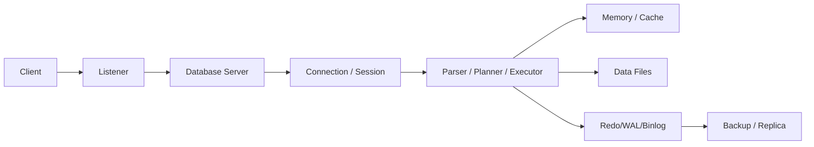

# PostgreSQL — Architecture

> Database baseline: 18.6  
> Default port: 5432  
> Linux service: `postgresql.service`

## Scope

This chapter is written for Linux Administrator / DBA / DevOps / SRE / Kubernetes / OpenShift work. Commands are examples for a controlled lab and must be adapted to the installed version and environment.

## Assumptions

```text
OS: RHEL 9 or compatible Enterprise Linux
Hostname: db01
Database: PostgreSQL
Port: 5432
Administrative access: root or sudo
```

## 1. Architecture

A production database is a system of processes, memory, durable storage, logs, network endpoints, metadata and recovery mechanisms.



## 2. Investigation layers

```text
Application
   ↓
DNS / Network
   ↓
TCP port
   ↓
Database listener
   ↓
Authentication
   ↓
Session
   ↓
SQL
   ↓
Lock / CPU / Memory / I/O
   ↓
Filesystem
   ↓
Disk / SAN / Cloud volume
```

## 3. Linux process checks

```bash
ps -ef | grep -E 'postgres|mysqld|mariadbd' | grep -v grep
ss -lntp
systemctl status {service}
journalctl -u {service} -n 100 --no-pager
```

## 4. Architecture questions

Ask:
- Which process accepts connections?
- Where is durable data stored?
- What log records recovery information?
- What happens after an unclean shutdown?
- How is a replica synchronized?
- What is the failure domain?
- Which component performs authentication?
- Which metric proves health?

## 5. L3 principle

Never stop at “database is slow.” Break the symptom into connection, query, lock, CPU, memory, I/O, storage latency, replication, or application behavior.

## PostgreSQL-specific operational notes

- Default port: `5432`.
- Service name in this handbook: `postgresql.service`.
- CLI: `psql`.
- Data location used as a lab baseline: `/var/lib/pgsql/18/data`.
- Replication model: Physical streaming replication; logical replication.
- HA model: Streaming replication plus an external failover/orchestration layer.

## Validation principle

A command is not considered successful until its effect is verified. Prefer:
```bash
systemctl is-active postgresql.service
ss -lntp | grep 5432
```
plus a database-native health query.

## Version discipline

Do not assume that an older blog post, copied command, or container tag applies to the current release. Record the exact installed version and consult the vendor's current documentation when syntax or behavior is version-sensitive.
