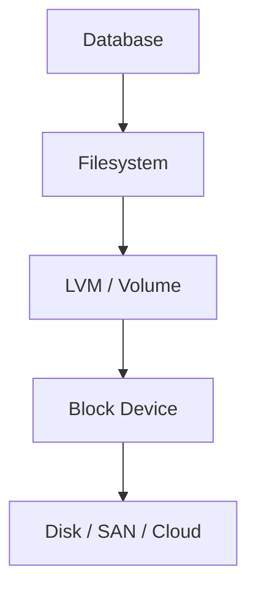

# PostgreSQL — Storage

> Database baseline: 18.6  
> Default port: 5432  
> Linux service: `postgresql.service`

## Scope

This chapter is written for Linux Administrator / DBA / DevOps / SRE / Kubernetes / OpenShift work. Commands are examples for a controlled lab and must be adapted to the installed version and environment.

## Assumptions

```text
OS: RHEL 9 or compatible Enterprise Linux
Hostname: db01
Database: PostgreSQL
Port: 5432
Administrative access: root or sudo
```

## 1. Storage model

Database durability depends on filesystem and block-storage behavior.



## 2. Linux checks

```bash
lsblk -f
df -hT
df -ih
findmnt
mount
```

## 3. Capacity

Watch both:
- data blocks
- inode usage
- WAL/binlog growth
- temporary files
- logs
- backup staging

## 4. I/O

```bash
iostat -xz 1 5
pidstat -d 1 5
vmstat 1 5
```

High latency with low throughput can still make a database slow.

## 5. Production rule

Never manually delete unknown database files to free space. First identify whether the files are data, WAL/redo, binary logs, temporary files, archived logs, backups, or operational metadata.

## PostgreSQL-specific operational notes

- Default port: `5432`.
- Service name in this handbook: `postgresql.service`.
- CLI: `psql`.
- Data location used as a lab baseline: `/var/lib/pgsql/18/data`.
- Replication model: Physical streaming replication; logical replication.
- HA model: Streaming replication plus an external failover/orchestration layer.

## Validation principle

A command is not considered successful until its effect is verified. Prefer:
```bash
systemctl is-active postgresql.service
ss -lntp | grep 5432
```
plus a database-native health query.

## Version discipline

Do not assume that an older blog post, copied command, or container tag applies to the current release. Record the exact installed version and consult the vendor's current documentation when syntax or behavior is version-sensitive.
