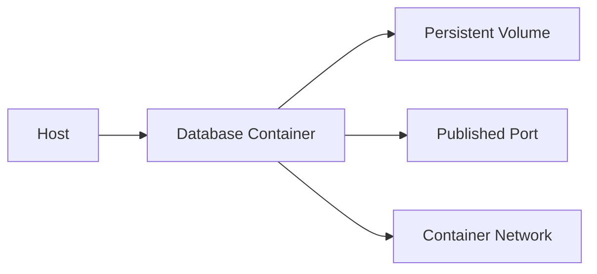

# PostgreSQL — Docker

> Database baseline: 18.6  
> Default port: 5432  
> Linux service: `postgresql.service`

## Scope

This chapter is written for Linux Administrator / DBA / DevOps / SRE / Kubernetes / OpenShift work. Commands are examples for a controlled lab and must be adapted to the installed version and environment.

## Assumptions

```text
OS: RHEL 9 or compatible Enterprise Linux
Hostname: db01
Database: PostgreSQL
Port: 5432
Administrative access: root or sudo
```

## 1. Container model



## 2. Lab pattern

Use the official image for the database and pin a tested tag rather than using an unqualified `latest` tag in production.

Example PostgreSQL:

```bash
docker volume create pgdata
docker run -d --name postgres   -e POSTGRES_PASSWORD='ChangeMe_Strong_123!'   -p 5432:5432   -v pgdata:/var/lib/postgresql/data   postgres:18
```

MySQL:

```bash
docker volume create mysqldata
docker run -d --name mysql   -e MYSQL_ROOT_PASSWORD='ChangeMe_Strong_123!'   -p 3306:3306   -v mysqldata:/var/lib/mysql   mysql:9.7
```

MariaDB:

```bash
docker volume create mariadbdata
docker run -d --name mariadb   -e MARIADB_ROOT_PASSWORD='ChangeMe_Strong_123!'   -p 3306:3306   -v mariadbdata:/var/lib/mysql   mariadb:12.3
```

## 3. Verification

```bash
docker ps
docker logs --tail 100 <container>
docker inspect <container>
docker volume inspect <volume>
```

## 4. Production cautions

- persistent volumes
- backups outside the container
- secrets
- resource limits
- image provenance
- patch strategy
- health checks
- graceful shutdown

## PostgreSQL-specific operational notes

- Default port: `5432`.
- Service name in this handbook: `postgresql.service`.
- CLI: `psql`.
- Data location used as a lab baseline: `/var/lib/pgsql/18/data`.
- Replication model: Physical streaming replication; logical replication.
- HA model: Streaming replication plus an external failover/orchestration layer.

## Validation principle

A command is not considered successful until its effect is verified. Prefer:
```bash
systemctl is-active postgresql.service
ss -lntp | grep 5432
```
plus a database-native health query.

## Version discipline

Do not assume that an older blog post, copied command, or container tag applies to the current release. Record the exact installed version and consult the vendor's current documentation when syntax or behavior is version-sensitive.
