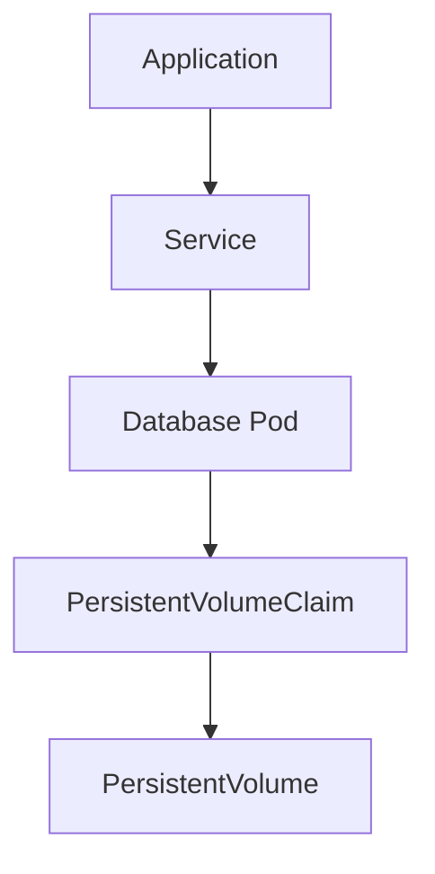

# PostgreSQL — Kubernetes

> Database baseline: 18.6  
> Default port: 5432  
> Linux service: `postgresql.service`

## Scope

This chapter is written for Linux Administrator / DBA / DevOps / SRE / Kubernetes / OpenShift work. Commands are examples for a controlled lab and must be adapted to the installed version and environment.

## Assumptions

```text
OS: RHEL 9 or compatible Enterprise Linux
Hostname: db01
Database: PostgreSQL
Port: 5432
Administrative access: root or sudo
```

## 1. Database on Kubernetes

Stateful databases require deliberate treatment of:
- persistent storage
- identity
- stable network names
- startup ordering
- readiness
- backup
- failover
- disruption
- security

## 2. Basic lab objects



## 3. Generic checks

```bash
kubectl get pods -o wide
kubectl get svc
kubectl get pvc
kubectl describe pod <pod>
kubectl logs <pod> --tail=200
kubectl get events --sort-by=.lastTimestamp
```

## 4. Do not assume

A Deployment with one database pod is not automatically HA. A PVC is not automatically a backup. A Pod restart is not a recovery strategy.

## 5. Operator model

For production, evaluate a database operator when it provides tested automation for:
- provisioning
- upgrades
- backups
- failover
- replication
- certificates
- status conditions

Verify operator/database version compatibility before deployment.

## PostgreSQL-specific operational notes

- Default port: `5432`.
- Service name in this handbook: `postgresql.service`.
- CLI: `psql`.
- Data location used as a lab baseline: `/var/lib/pgsql/18/data`.
- Replication model: Physical streaming replication; logical replication.
- HA model: Streaming replication plus an external failover/orchestration layer.

## Validation principle

A command is not considered successful until its effect is verified. Prefer:
```bash
systemctl is-active postgresql.service
ss -lntp | grep 5432
```
plus a database-native health query.

## Version discipline

Do not assume that an older blog post, copied command, or container tag applies to the current release. Record the exact installed version and consult the vendor's current documentation when syntax or behavior is version-sensitive.
